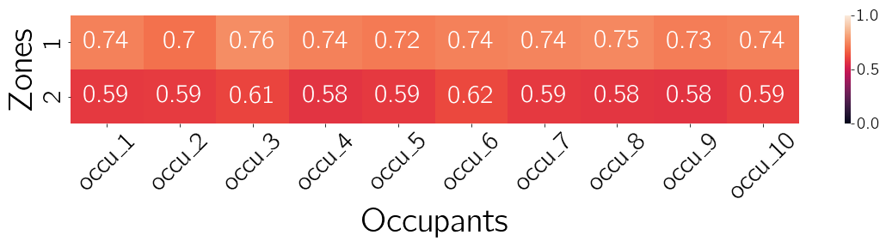

# ComfortLearn

  

ComfortLearn is an OpenAI Gym-like environment that leverages historical Building Management System (BMS) data from real buildings and existing longitudinal thermal comfort datasets for Occupant-Centric Control strategies and benhmarking.

This platform is developed by [**Matias Quintana**](https://matiasquintana.com/).

## Contributing
We welcome contributions in different forms, from bug reports to pull requests.
We encourage the community to use, improve, and extend ComfortLearn by adding new zones and energy functions models and sharing the implementation of control algorithms, as well as the inclusion of more longitudinal thermal comfort datasets.
For major changes, please open an issue to discuss how you would like to change the platform.

## Requirements

Refer to `requirements.txt` for a list of Python library dependencies. You may install the required libraries by executing the following command:

`pip install -r requirements.txt`

## Documentation

### Files and Folders

- `main.py`: Main file to execute the environment and the simulation.
- `comfortlearn.py`: Contains the ComfortLearn environment and the class `Occupant` and functions `zone_loader()` and `occupant_loader()`.
- `common/`: Contains files for preprocessings and utility functions.
- `img/`: Contains all generated images and figures.

#### Modifyable by the user
- `zones_state_action_space.json`: JSON file containing the possible states and actions for every zones building.
- `zone_attributes.json`: JSON file containing the attributes of the zones. These zones can be dependant on the empiricald thermal comfort datasets available and are located within the respective `data/` folder.
- `energy_models.py`: Contains the class Zone which is called by the ComfortLearn class.
- `agent.py`: File that contains the agent class that will learn to control the Zone(s) temperature set-point.
- `reward_function.py`: Contains the function `reward_function_sa()` to help the controller find an optimal control policy.
- `occupant_data_preprocessing_<DATASET>.ipynb`: Notebook with preprocessing and cleaning of a respective `<DATASET>`.
- `zone_data_preprocessing.ipynb`: Notebook with preprocessing and cleaning of Zone(s) data and weather data.
- `results_loop.ipynb`: Notebook that analyses the simulation results.
- `train_pcm.py`: Defines and trains Personal Comfort Models (PCM) for occupants in a dataset in `data/`.
- `data/`: Contains the different thermal preference datasets.
- `configs/`: Contain configuration files with the following:

| Variable | Values | Description |
| -------- | ------ | ----------  |
| `config_name` | String | Experiment name |
| `seed` | Int | Seed value |
| `data_path` | String | Empirical datasets folder path |
| `num_new_occupants` | Int | Number of occupants as agents |
| `zone_selection` | random, forced | Occupant movement between zones |
| `occupant_timing` | fixed, stochastic | Occupant's enter and leave time |
| `occupant_tolerance` | Float | Number within $[0, 1]$ for filtering occupants |
| `occupant_tol_file` | String | CSV with occupants and their tolerance path |
| `occupant_preference` | String | CSV with occupants thermal preference path |
| `occupant_background` |String | CSV with occupants metadata path |
| `occupant_pcm` | Pickle | Path to Pickle file with occupants PCM |
| `zone_attributes` | String | Zone(s) attributes JSON path |
| `weather_file` | String | Weather CSV path |
| `zones_states_actions` | String | Zone(s) state action space JSON path |
| `max_steps` | Int | Number of steps for the simulation |
| `cost_function` | List of Strings | Name of the evaluation metrics to use |
| `central_agent` | Boolean | `True`: Central agent, `False`: Multi-agent |
| `save_memory` | Boolean | For RL's agent's buffer |
| `verbose` | Boolean | `True`: Debugging mode |
| `agent_type` | String | Name of the class of agent to use |

### PCM
Each occupant in the occupant dataset had a Random Forest model trained on its
data using a 5-fold cross-validation with F1-micro as evaluation metric.

Details about the modeling are stored within the `config/`folder.
Example:

`python train_pcm.py configs/train_pcm_<DATASET>.yaml`

This procedure is taken from *Quintana, M., Schiavon, S., Tartarini, F., Kim, J., & Miller, C. (2022). Cohort comfort models--Using occupants' similarity to predict personal thermal preference with less data. arXiv preprint arXiv:2208.03078.*

## Simulation
To execute one full run of the simulation, simply run:

`python main.py <your_config_file>.yaml`

You can also manually set the seed directly as an argument:

`python main.py <your_config_file>.yaml 10`

In this case the seed used throughout the simulation is `10`

Bash scripts are also included to run simulations with different zones and/or different occupant profiles.

If you want to run a specific experiment, make sure to create a `yaml` file with the different paramters for the envionrment and agent. Examples of this can be found in the `configs` folder.
The script `./run_all_zones_loop.sh 010` runs simulations on both temperature zones with occupants with a tolerance of 10%

## Case study: Occupant profiles in different temperature zones
We present a real-world case study of ComfortLearn where we use historical data from a real building and data from existing longitudinal thermal comfort datasets.
The building and thermal comfort datasets were obtained in Singapore (tropical climate), classified by ASHRAE as climate zone 1A.
In total, two rooms with different ventilation mechanism from an educational building were chosen.
These rooms are university classrooms that host students throughout the academic year and environmental data is continuously being logged by the building's BMS system.
The period of analysis is one full work week, 2021-10-18 to 2021-10-22, middle of the fall semester, and time steps of 15 minutes are chosen.
The dataset can be download here. @TODO: add URL

More simulation parameters and their values chosen for this case study are:

|       Parameter         |                         Value                           |
| ----------------------- | ------------------------------------------------------- |
| Occupant arrival time   | Sampled from $\mathcal{N}(\mu=8, \sigma^{2}=2)$         |
| Occupant departure time | Sampled from $\mathcal{N}(\mu=17, \sigma^{2}=2)$        |
| Num. of occupants       | 10                                                      |
| Tolerance parameter     | [0.10, 0.30, 0.60, 1.00]                                |
| Num. Temperature zones  | 2                                                       |
| Time duration           | One full week                                           |
| Time steps              | 672 (15 minutes intervals)                              |
| Iterations              | 30                                                      |

### Results

Daily average UNC values for each occupant averaged over 30 simulations for occupants with tolerance of $0.6$.
The **lower** the better.

Time-series of UNC values throughout a week for a single occupant of tolerance $1.0$ (top) and $0.6$ (bottom).
Darker line is the mean over time with shaded region represented by 2-standard deviation and a dashed line at a UNC value of $0.5$.
The **lower** the better.

## Learning
As of the release of ComfortLearn, building control strategies have not yet been benchmarked nor implemented.
The case study presented so far focuses on evaluation buildings historical data.

Nevertheless, the files that would require modification for such implementation are the following:
Main editable files for own submissions:
- ``agent.py``
- ``reward_function.py``

## Cite ComfortLearn
[Quintana, M., Nagy, Z., Tartarini, F., Schiavon, S., & Miller, C. (2022). ComfortLearn: Enabling agent-based occupant-centric building controls. Third ACM SIGEnergy Workshop on Reinforcement Learning for Energy Management in Buildings & Cities (RLEM) (RLEM ’22), 4. https://doi.org/10.1145/3563357.3566167
](https://doi.org/10.1145/3563357.3566167)

## License

MIT License

Copyright (c) 2022 Building and Urban Data Science (BUDS) Group

Permission is hereby granted, free of charge, to any person obtaining a copy of this software and associated documentation files (the "Software"), to deal in the Software without restriction, including without limitation the rights to use, copy, modify, merge, publish, distribute, sublicense, and/or sell copies of the Software, and to permit persons to whom the Software is furnished to do so, subject to the following conditions:

The above copyright notice and this permission notice shall be included in all copies or substantial portions of the Software.

THE SOFTWARE IS PROVIDED "AS IS", WITHOUT WARRANTY OF ANY KIND, EXPRESS OR IMPLIED, INCLUDING BUT NOT LIMITED TO THE WARRANTIES OF MERCHANTABILITY, FITNESS FOR A PARTICULAR PURPOSE AND NONINFRINGEMENT. IN NO EVENT SHALL THE AUTHORS OR COPYRIGHT HOLDERS BE LIABLE FOR ANY CLAIM, DAMAGES OR OTHER LIABILITY, WHETHER IN AN ACTION OF CONTRACT, TORT OR OTHERWISE, ARISING FROM, OUT OF OR IN CONNECTION WITH THE SOFTWARE OR THE USE OR OTHER DEALINGS IN THE SOFTWARE.

